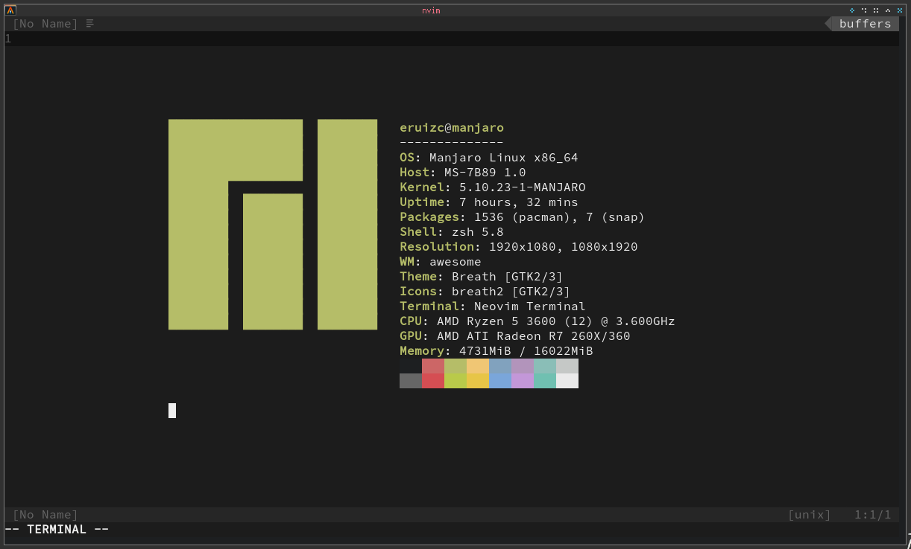

## Vim Flex

Sometimes you need to show everyone in the office how weirdo you are,
with Vim Flex you can `:Flex` to everyone without the needing to exit vim!



> Disclaimer:
>
>  - Works best with Arch, Gentoo or any BSD system

### Installation

 1. Make sure you meet the requirements
     - NeoVim (0.5+)
     - neofetch
 2. Install! We recommend [Plug](https://github.com/junegunn/vim-plug)
    ```vim
    Plug 'eruizc-dev/vim-flex'
    ```
 3. For troubleshooting you can run `:checkhealth` and see if everythin is OK
 under `health#flex#check`. Feel free to [open an issue](https://github.com/eruizc-dev/vim-flex/issues/new).
