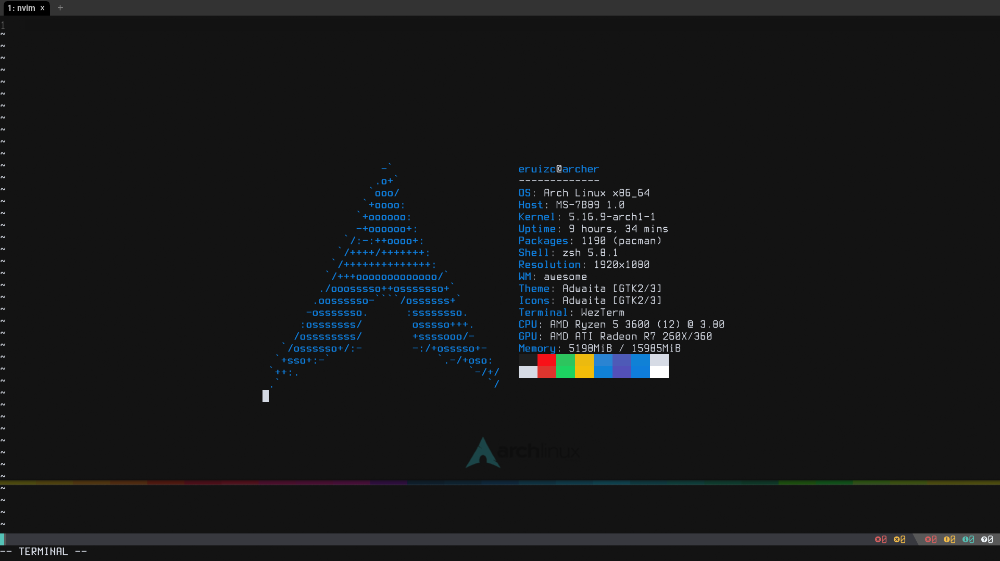

## Arch Btw

Flex without exiting vim

### Requirements

 - [arch btw](https://wiki.archlinux.org/title/Installation_guide)
 - [neofetch](https://archlinux.org/packages/community/any/neofetch/)

### Installation

Figure it out yourself
